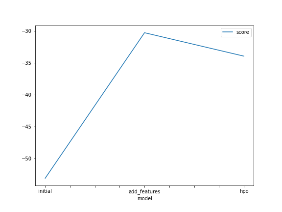
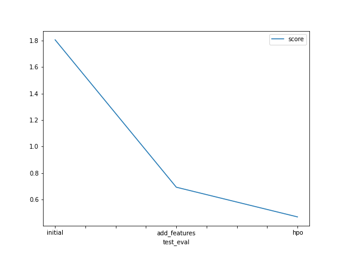

# Report: Predict Bike Sharing Demand with AutoGluon Solution
#### Sonny Ochoa

## Initial Training
### What did you realize when you tried to submit your predictions? What changes were needed to the output of the predictor to submit your results?
The initial model I submitted performed poorly. I needed modify the parsing of the datetime column to certain `dt` features in pandas. I also needed to ensure that all predictions were `> 0`.

### What was the top ranked model that performed?
`WeightedEnsemble_L3`

## Exploratory data analysis and feature creation
### What did the exploratory analysis find and how did you add additional features?
I separated out the `datetime` into `hour`, `day`, `month`, and `year`. I also set the `dtype` for `season` and `weather` to the type: `category`.

### How much better did your model preform after adding additional features and why do you think that is?
After the initial feature engineering, the Kaggle score went from `1.80581 -> 0.69207`, which is an improvement of `261%` improvement. This can be due to the fact that when we create new feature, that may contain valuable information, which can capture patterns that weren't visible before. Also, how we represent data, such as with `season` and `weather`, can lead to a better fit of the machine learning model to the data. This can lead to improved performance and predictive accuracy.

## Hyper parameter tuning
### How much better did your model preform after trying different hyper parameters?
After trying different hyper parameters, I was able to get the Kaggle score to go from `0.69207 -> 0.46771`, which is a `47.9%` improvement.

### If you were given more time with this dataset, where do you think you would spend more time?
Given more time I would spend it on exploratory data analysis, which can help us identify data quality issues such as missing values, outliers, or inconsistent data, which can affect the performance of the machine learning model.. With a better understanding of the dataset, it can help with engineering new features from the existing data, which can improve the performance of the machine learning model.

### Create a table with the models you ran, the hyperparameters modified, and the kaggle score.
|model|hpo1|hpo2|hpo3|score|
|--|--|--|--|--|
|initial|default|default|default|1.80581|
|add_features|default|default|default|0.69207|
|hpo|nn_options = { 'num_epochs': 50, 'learning_rate': ag.space.Real(1e-4, 1e-2, default=5e-4, 'activation': ag.space.Categorical('relu', 'softrelu', 'tanh'), 'dropout_prob': ag.space.Real(0.5, 0.8, default=0.1),}|gbm_options = { 'num_boost_round': 100, 'num_leaves': ag.space.Int(lower=68, upper=100, default=36),}|num_bag_folds=10, num_bag_sets=1|0.46771|

### Create a line plot showing the top model score for the three (or more) training runs during the project.

### Create a line plot showing the top kaggle score for the three (or more) prediction submissions during the project.

## Summary
The initial model performed poorly, which lead to some feature engineering. I split the datetime values into their own features. I also set the dtype for `season` and `weather` to category type which improved the model's performance.

I was further able to improve the model by trying different hyperparameters. This improved our final model's Kaggle score from initially getting `1.80581` down to `0.46771`, which is a total improvement of `386%`.

Given more time with the dataset, the focus would be on exploratory data analysis to identify data quality issues, and then to engineer new features.
